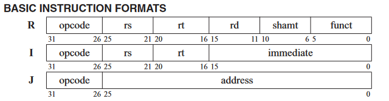

# Lab 4

## Introduction
In this lab, you'll gain experience working with MIPS instructions by coding a MIPS VM/simulator. In general, your simulator: 
1. will first convert an integer value into a 32-bit machine (i.e., binary) instruction, 
2. determine the type of instruction (R or I), 
3. identify the field values (i.e., opcode, rs, rt, rd, sa, func, imm, etc.), and then 
4. execute the instruction using a simulated set of registers.  

In particular, this lab has four goals:
* Apply knowledge gained in lab 3 (e.g., bit set, mask, select operations) to identify fields in a binary instruction.
* Gain experience with MIPS R-type and I-type instructions.
* Develop a program that closely simulates a real problem.
* Gain experience using C-language structs and enumerations.


## Background reading
* Functions, Data Structures, Input/Output (I/O) [Lecture slides](https://sakai.unc.edu/access/content/group/167842e9-e6e0-4d16-81bd-842fcf59831e/Lecture%20Slides/8_31_21.pdf)
* Chpts 4, 6, and 7 in [CProg textbook](https://sakai.unc.edu/access/content/group/167842e9-e6e0-4d16-81bd-842fcf59831e/Textbooks/CProgramming.pdf)
* MIPS [cheatsheet](https://sakai.unc.edu/access/content/group/167842e9-e6e0-4d16-81bd-842fcf59831e/Supplemental/mips_cheat_sheet.pdf)
* Assembly to Machine Language: MIPS instruction set [Lecture slides](https://sakai.unc.edu/access/content/group/167842e9-e6e0-4d16-81bd-842fcf59831e/Lecture%20Slides/9_28_21.pdf)
* Sections 2,1, 2.2 and 2.3 in [COD textbook](https://sakai.unc.edu/access/content/group/167842e9-e6e0-4d16-81bd-842fcf59831e/Textbooks/ComputerOrganizationAndDesign.pdf)

## Note about fixed-width integer types
Throughout the lab, you will see `uint8_t`, `uint16_t`, or `uint32_t` being used as types. These are simply unsigned data types that are used to represent an integer in an explicit amount of `N` bits.
* `uint8_t` represents an `unsigned char` with a size of 8 bits.
* `uint16_t` represents an `unsigned short` with a size of 16 bits.
* `uint32_t` represents an `unsigned int` with a size of 32 bits.

The values of these types range from `0` to <code>2<sup>N</sup> - 1</code> since they are unsigned. You can read more about these types in this [article](https://www.badprog.com/c-type-what-are-uint8-t-uint16-t-uint32-t-and-uint64-t) or this [manual](https://www.gnu.org/software/libc/manual/html_node/Integers.html).

## Lab structure
* `Makefile`- contains information used to compile your program with the `make` command. **Please do not modify.**
* `bit_utils.h` - includes declarations and specifications for the functions in `bit_utils.c`. **Please do not modify.**
* `bit_utils.c` - includes functions implemented in Lab 03.
* `instructions.h` - contains definitions for functions and structures for `instructions.c`. **Please do not modify.**
* `instructions.c` - contains functions to be implemented in part 1. You will need to implement the functions listed below:
    * `get_type_of_instruction`: determines whether you are working with an R type or I type instruction, based on the instruction given as a 32-bit integer.
    * `create_r_instruction`: creates a pointer to an `r_instruction` struct with all fields filled, based on the instruction given as a 32-bit integer.
    * `create_i_instruction`: creates a pointer to an `i_instruction` struct with all fields filled, based on the instruction given as a 32-bit integer.
* `lab04.c`- contains the main function. You will need to implement the functions listed below:
    * `execute_r_instruction`: takes in a pointer to an `r_instruction` struct, and based on the MIPS instruction, performs it and updates the associated register.
    * `execute_i_instruction`: takes in a pointer to an `i_instruction` struct, and based on the MIPS instruction, performs it and updates the associated register.
 
The specific MIPS instructions you will implement are listed in both the `lab04.c` file and in [Part 2](#part-2).

There are many comments in the `lab04.c` and `instructions.c` source files as well as in the `instructions.h` header file. Read the comments carefully, as they provide information needed to complete this assignment.

## Part 0
Take a look through each source file and read the comments to have a better understanding of the assignment and the functions you will need to implement.

You will need to copy your solution from Lab 03, `bit_utils.c`, so you can use the functions you implemented to solve this lab. If you are not confident in your solution, you are welcome to use the given solution posted on Sakai.

**Make sure to fill out the honor code at the top of `lab04.c` and `instructions.c`, or the autograder will not give any credit.**

## Part 1
First, you have to edit `instructions.c` to implement `get_type_of_instruction`. `get_type_of_instruction` determines the instruction type given an unsigned 32-bit integer, by returning an `instruction_type` enum value. For example, if I type in the following 32-bit integer:
```
00000001000000110001000000100010
``` 
the function should be able to recognize it as an R-type instruction, and return `R_TYPE`. Although J-type instructions also exist in MIPS, you only have to distinguish between R-type or I-type.

You then have to implement `create_r_instruction`, `create_i_instruction`, which serve as "constructors" for the `r_instruction` and `i_instruction` structs, which are defined as follows in `instructions.h`:
```c
typedef struct {
    uint8_t rs;
    uint8_t rt;
    uint8_t rd;
    uint8_t shamt;
    uint8_t func;
} r_instruction;

typedef struct { 
    uint8_t opcode;
    uint8_t rs;
    uint8_t rt;
    uint16_t immediate;
} i_instruction;
```
`create_r_instruction`, `create_i_instruction` are given the instruction as a 32-bit integer, and must return a pointer to a `malloc`'d `r_instruction`/`i_instruction` with all fields initialized.

In the next part of this lab, these structures are used for execution.

You may reference this image which details the position of the fields that each instruction type has:


`instructions.h` has several constants which you may take advantage of for implementing these methods.

## Part 2
Now, you have to edit `lab04.c` to implement `execute_r_instruction` and `execute_i_instruction`. `execute_r_instruction` accepts a pointer to an `r_instruction`, while `execute_i_instruction` accepts a pointer to an `i_instruction`, and each execute that instruction.

Each instruction modifies a register, so you should update the `registers` global array variable as appropriate. For example, for the given MIPS instruction:
```asm
and $4, $1, $2
```
Register #4 would be updated with the contents of the bitwise AND of register #1 and register #2, like follows:
```c
registers[4] = registers[1] & registers[2];
```

The follow MIPS instructions need to be implemented: `sll`, `sra`, `add`, `sub`, `and`, `or`, `nor`, `addi`, `andi`, `ori`. Although it's a lot of instructions, each does something pretty simple.

There are several nuances in MIPS architecture that may complicate things. For example, `$0`/`$zero` (the "zero register") is usually only being readable, and not writable. However, although you will have to consider this in COMP 311, for this lab, all 32 registers can be considered general registers. Furthermore, you do not need to consider the signed extension of immediate values. Each update to a register should be fairly straightforward, similar to above.

## Examples/testing
Consider the following sequence of MIPS instructions:
```asm
addi $0, $0, 21834		# r[0] = r[0] + 21834
add $1, $0, $0			# r[1] = r[0] + r[0]
sub $2, $1, $0			# r[2] = r[1] - r[0]
ori $3, $2, 1			# r[3] = r[2] | 1
```

In order to execute this series of instructions, each instruction would be need to be translated to its binary equivalent by using an assembler. Using your [MIPS cheatsheet](https://sakai.unc.edu/access/content/group/167842e9-e6e0-4d16-81bd-842fcf59831e/Supplemental/mips_cheat_sheet.pdf), you can do this translation yourself.

```
00100000000000000101010101001010
00000000000000000000100000100000
00000000001000000001000000100010
00110100010000110000000000000001
```

For this lab, each instruction is accepted as an integer through standard input, so each binary instruction will need to undergo another conversion:

```
536892746
2080
2101282
876806145
```

You can then enter each integer into the simulator. To exit the simulator, you can enter the integer `4294967295`. The `main` method handles this special instruction, so you don't need to implement it.

```
Please enter your instruction as a 32-bit integer: 536892746
Current register status:
[21834, 0, 0, 0, 0, 0, 0, 0, 0, 0, 0, 0, 0, 0, 0, 0, 0, 0, 0, 0, 0, 0, 0, 0, 0, 0, 0, 0, 0, 0, 0, 0]
Please enter your instruction as a 32-bit integer: 2080
Current register status:
[21834, 43668, 0, 0, 0, 0, 0, 0, 0, 0, 0, 0, 0, 0, 0, 0, 0, 0, 0, 0, 0, 0, 0, 0, 0, 0, 0, 0, 0, 0, 0, 0]
Please enter your instruction as a 32-bit integer: 2101282
Current register status:
[21834, 43668, 21834, 0, 0, 0, 0, 0, 0, 0, 0, 0, 0, 0, 0, 0, 0, 0, 0, 0, 0, 0, 0, 0, 0, 0, 0, 0, 0, 0, 0, 0]
Please enter your instruction as a 32-bit integer: 876806145
Current register status:
[21834, 43668, 21834, 21835, 0, 0, 0, 0, 0, 0, 0, 0, 0, 0, 0, 0, 0, 0, 0, 0, 0, 0, 0, 0, 0, 0, 0, 0, 0, 0, 0, 0]
Please enter your instruction as a 32-bit integer: 4294967295
```

## Submit your assignment
1. Use git to push your finished code to this GitHub repository.
2. Go to the COMP 211 course in GradeScope and click on the assignment called **Lab 04**.
3. Click on the option to **Submit Assignment** and choose GitHub as the submission method.
4. You should see a list of your public repositories. Select the one named **lab-04-yourname** and submit it.
5. Your assignment should be autograded within a few seconds, and you will receive feedback for the autograded portion.
6. If you receive all the points, then you have completed this lab! Otherwise, you are free to keep pushing commits to your GitHub repository and submit for regrading up until the deadline of the lab.

## Grading
### Autograder tests (8 pts)
Remember, you can submit as many times as you like before the due date to get full credit.

### Style (2pts)
* Variable Names (.5 pts)
	* Single-character variable names are only used for counting/indexing, or when used to represent a variable whose type has only one instance.
	* All "magic numbers" are defined as constants.
	* Variable names are either related to the usage of the variable, or the meaning is commented.
	* No unused variables are declared.
* Readability (.75 pts)
	* Proper indentation (use the following Vim trick: (1G=G) )
	* Consistent whitespace theme used throughout.
	* Logically distinct blocks of code are separated by whitespace.
	* No more than two consecutive lines of empty whitespace.
	* No old debug code is present (including in the comments).
* Correctness of Code (.75 pts)
	* For all functions (including main if applicable), every path of execution leads to a return statement.
	* No libraries are included that weren't provided in the starter code or mentioned in the README.

We reserve the right to deduct points from the autograder if we notice that you have hard-coded any test cases and not actually fully implemented the functions.
